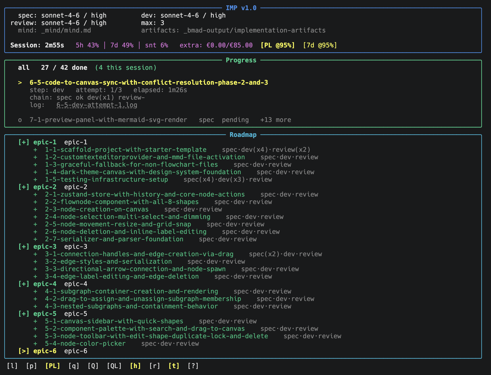

<p align="center">
  
</p>

<p align="center">
  
  &nbsp;
  
  &nbsp;
  
  &nbsp;
  
</p>

---

## What is IMP Agent?

`imp` is an autonomous pipeline engine for [BMAD](https://github.com/bmad-method/bmad-method). It drives `/bmad-create-story`, `/bmad-dev-story`, and `/bmad-code-review` in a continuous loop over your sprint stories — with a Rich TUI, a persistent ledger, per-story usage gates, and keyboard controls.

I built it because running BMAD stories by hand means babysitting a terminal. You kick off a story, wait, check it, kick off the next one. IMP does that loop for you. It runs until the sprint is done, pauses where you tell it to, and stays out of the way in between.

Both **Claude Code** and **Codex CLI** are supported.

## Install

Run from your project root (BMAD must already be set up):

```bash
curl -fsSL https://raw.githubusercontent.com/SauliusDev/imp-agent/main/setup.sh | bash
```

For Codex projects:

```bash
npx bmad-method@latest install --tools codex --directory .
curl -fsSL https://raw.githubusercontent.com/SauliusDev/imp-agent/main/setup.sh | IMP_AGENT_PROVIDER=codex bash
```

## Prerequisites

- **BMAD** set up in the project — Claude: `.claude/skills/bmad-dev-story/` · Codex: `.agents/skills/bmad-dev-story/`
- **Python 3.10+**
- **Claude Code CLI** (`claude` on PATH) or **Codex CLI** (`codex` on PATH)
- **`rich`** Python package (installer offers to install it)

## What gets installed

| Path | Description |
|---|---|
| `_imp/` | IMP engine (7 Python files + shell launcher) |
| `.claude/skills/imp-init/` | Skill to initialize the ledger (Claude) |
| `.agents/skills/imp-init/` | Skill to initialize the ledger (Codex) |
| `_imp/config.yaml` | Pipeline config — edit before first run |

## Getting started

1. **Edit `_imp/config.yaml`** — set `agent_provider`, models, usage caps, pause points
2. **Run `/bmad-sprint-planning`** — generates `sprint-status.yaml`
3. **Run `/imp-init`** — initializes the ledger from `sprint-status.yaml`
4. **Run `bash _imp/imp.sh all`** — starts the pipeline

For Codex, update `config.yaml`:

```yaml
agent_provider: codex
model_spec: gpt-5.5
model_dev: gpt-5.5
model_review: gpt-5.5
```

## Usage

```bash
bash _imp/imp.sh all        # run all epics
bash _imp/imp.sh epic-1     # run a single epic
bash _imp/imp.sh --help
```

Keyboard shortcuts while running:

| Key | Action |
|-----|--------|
| `p` | Pause / resume |
| `l` | Toggle story output |
| `r` | Reload config |
| `q` | Quit |

## Re-installing / updating

Re-run the same `curl` command. Engine files are always overwritten. Your `_imp/config.yaml` and `_imp/ledger.json` are preserved.


